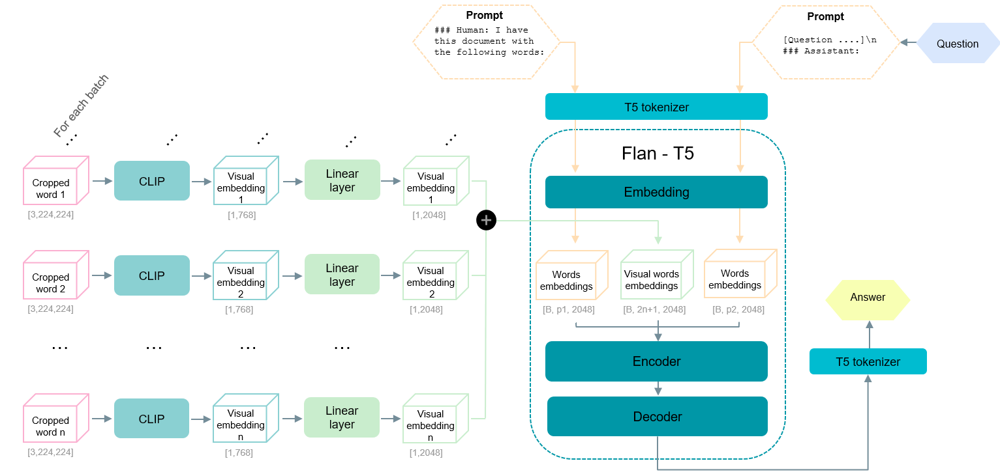

# Large Language Models for Document Visual Question Answering

This repository is an extension of the [FastChat](https://github.com/lm-sys/FastChat) repository, implementing baselines and multimodal adaptations for utilizing Language Models (LLMs) in Document-based Visual Question Answering (DocVQA) as part of my Master's Thesis that can be found [here](https://www.overleaf.com/read/fcmbtrrprdwc).

## Models and Dataset
- **LLM:** We focus on the Flan-T5 model from the [FastChat](https://github.com/lm-sys/FastChat) repository due to computational limitations
- **Dataset:** We use a subset of the [SP-DocVQA](https://rrc.cvc.uab.es/?ch=17) dataset 

## Features
- **Spatial Information Integration:** Various methods have been added to incorporate spatial information from the text of the documents into the prompts.
- **Visual Domain Inclusion:** Visual features are extracted using a Vision Transformer (ViT) for each word in the document, enhancing the model's understanding of the visual context.
- **Pre-training Task:** A dedicated pre-training task has been designed to enable the Language Model to read and comprehend visual information.
- **Multimodal DocVQA:** We propose a multimodal approach to do DocVQA that represents initial steps toward developing a comprehensive and robust solution for addressing this challenging task end-to-end. 

## Install
git clone https://github.com/aolivtous/LLMs-for-DocVQA.git
cd LLMs-for-DocVQA

## Contents
### Configs
Contains the configuration of the SP-DocVQA dataset

### Utils

### Modified-Fastchat

